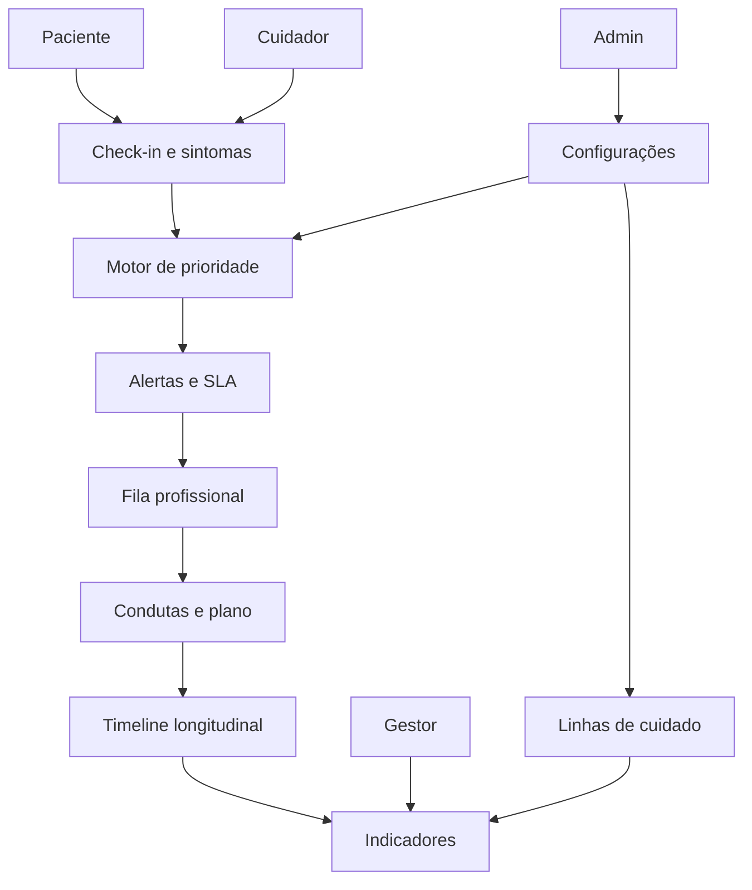

# Módulos e fluxos: Dignidade 360 Enterprise

## 1. Mapa geral de módulos

## 2. Módulo de identidade e acesso

### Funções

- Login.
- Convite de usuário.
- Recuperação de senha.
- Perfil por papel.
- Associação com organização/unidade.
- Associação com paciente.
- Controle de sessão.

### Perfis

- Paciente.
- Cuidador.
- Profissional.
- Coordenador.
- Gestor.
- Admin.

## 3. Portal do paciente

### Telas

- Painel.
- Check-in.
- Histórico.
- Plano de cuidado.
- Plano de crise.
- Agenda.
- Mensagens.
- Preferências.
- Consentimentos.
- Cuidador autorizado.

### Painel do paciente

Deve exibir:

- prioridade atual;
- último check-in;
- próxima agenda;
- mensagem da equipe;
- botão de check-in;
- botão de plano de crise;
- objetivo principal do cuidado.

### Check-in

Campos recomendados:

- dor;
- falta de ar;
- ansiedade;
- fadiga;
- apetite;
- sono;
- mobilidade;
- confusão;
- náusea/vômito;
- constipação;
- sofrimento emocional;
- sofrimento espiritual/existencial;
- crise hoje;
- observação livre.

## 4. Portal do cuidador

### Telas

- Painel do cuidado.
- Tarefas.
- Check-in assistido.
- Plano de crise.
- Sobrecarga do cuidador.
- Mensagens.
- Conteúdos.
- Luto, quando aplicável.

### Funções centrais

- Registrar sintomas em nome do paciente.
- Consultar plano de crise.
- Ver tarefas do dia.
- Solicitar apoio.
- Registrar sobrecarga.
- Receber orientações.

### Escala simples de sobrecarga

Campos:

- cansaço;
- sono do cuidador;
- rede de apoio;
- dificuldade prática;
- necessidade de contato;
- observação.

## 5. Portal profissional

### Telas

- Fila assistencial.
- Alertas.
- Pacientes.
- Timeline.
- Condutas.
- Plano de cuidado.
- Plano de crise.
- Reuniões familiares.
- Mensagens.
- Tarefas.

### Fila assistencial

Ordenação recomendada:

1. prioridade crítica;
2. SLA vencido;
3. prioridade alta;
4. tempo em aberto;
5. paciente vulnerável;
6. falta de check-in.

### Ações rápidas

- assumir alerta;
- responder mensagem;
- registrar orientação;
- ligar para cuidador;
- escalonar médico;
- solicitar visita;
- criar tarefa;
- resolver alerta.

## 6. Portal gestor

### Telas

- Dashboard.
- Unidades.
- Equipes.
- Linhas de cuidado.
- Indicadores.
- Alertas e SLA.
- Relatórios.
- Implantação.

### Indicadores principais

- pacientes ativos;
- pacientes por prioridade;
- alertas abertos;
- alertas críticos;
- SLA cumprido;
- check-ins realizados;
- planos de crise registrados;
- planos de cuidado ativos;
- famílias com sobrecarga alta;
- tempo médio de resposta;
- condutas por equipe;
- pacientes por unidade;
- pacientes por linha de cuidado.

## 7. Admin

### Telas

- organizações;
- unidades;
- usuários;
- papéis;
- permissões;
- protocolos;
- linhas de cuidado;
- conteúdos;
- integrações;
- auditoria.

## 8. Fluxo: entrada do paciente

1. Instituição identifica paciente elegível.
2. Paciente é cadastrado.
3. Cuidador é convidado, se autorizado.
4. Equipe cria avaliação inicial.
5. Plano de cuidado é iniciado.
6. Plano de crise é criado.
7. Check-in é ativado.
8. Paciente entra em acompanhamento.

## 9. Fluxo: check-in gera alerta

1. Paciente/cuidador envia check-in.
2. Sistema calcula prioridade.
3. Se prioridade moderada/alta/crítica, cria alerta.
4. Alerta entra na fila.
5. Profissional assume.
6. Conduta é registrada.
7. Status do alerta muda.
8. Desfecho é registrado.
9. Indicadores são atualizados.

## 10. Fluxo: plano de crise

1. Profissional cria plano.
2. Paciente/cuidador confirma entendimento.
3. Plano fica visível no portal.
4. Em crise, paciente/cuidador abre plano.
5. Equipe é acionada.
6. Conduta e desfecho são registrados.
7. Plano é revisado se necessário.

## 11. Fluxo: gestor configura linha de cuidado

1. Gestor acessa linhas de cuidado.
2. Cria nova linha.
3. Define critérios de entrada.
4. Define equipe responsável.
5. Define SLA.
6. Define questionários.
7. Define protocolos e conteúdos.
8. Ativa linha.
9. Acompanha indicadores.

## 12. Fluxo: luto

1. Óbito é registrado com cuidado.
2. Plano do paciente é encerrado.
3. Família recebe mensagem de acolhimento.
4. Sistema cria tarefa de contato pós-óbito.
5. Cuidador/família responde triagem de luto.
6. Casos de risco são encaminhados.

