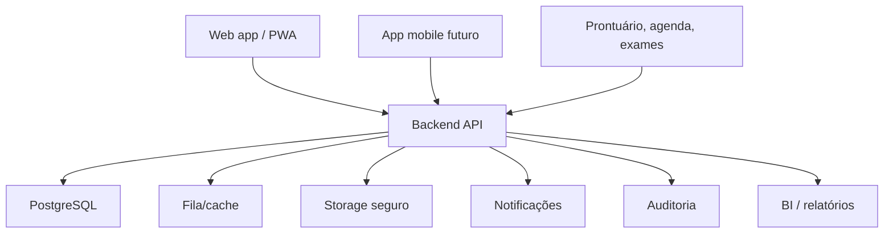

# Arquitetura, APIs e segurança

## 1. Arquitetura recomendada

## 2. Stack sugerida

### MVP no-code

- Airtable ou SmartSuite como base.
- Pory, Glide, Bubble ou Stacker como portal.
- Make/Zapier para automações.

### Produto real

- Frontend: Next.js ou React.
- Mobile/PWA: PWA primeiro; React Native ou Flutter depois.
- Backend: NestJS, FastAPI ou Django.
- Banco: PostgreSQL.
- Filas/cache: Redis.
- Arquivos: storage seguro.
- BI: Metabase, Superset ou dashboard próprio.
- Autenticação: OAuth2/OIDC ou auth própria com MFA.

## 3. Componentes

### Frontend

Responsável por:

- login;
- páginas por perfil;
- check-in;
- fila;
- dashboard;
- formulários;
- mensagens;
- acessibilidade.

### Backend

Responsável por:

- autenticação;
- autorização;
- regras de negócio;
- cálculo de prioridade;
- criação de alertas;
- APIs;
- auditoria;
- integrações;
- relatórios.

### Motor de prioridade

Deve calcular:

- prioridade do check-in;
- risco de crise;
- SLA recomendado;
- necessidade de alerta;
- necessidade de reavaliação.

### Auditoria

Registra:

- login;
- leitura de dados sensíveis;
- alteração de dados;
- exportação;
- alteração de permissão;
- atualização de plano;
- envio de mensagem.

## 4. APIs principais

## 4.1 Autenticação

- `POST /auth/login`
- `POST /auth/logout`
- `POST /auth/refresh`
- `GET /auth/me`
- `POST /auth/invite`
- `POST /auth/reset-password`

## 4.2 Paciente

- `GET /patient/me/dashboard`
- `GET /patient/me/timeline`
- `POST /patient/me/checkins`
- `GET /patient/me/care-plan`
- `GET /patient/me/crisis-plan`
- `GET /patient/me/appointments`
- `GET /patient/me/messages`
- `POST /patient/me/caregivers/invite`
- `GET /patient/me/consents`
- `PATCH /patient/me/consents`

## 4.3 Cuidador

- `GET /caregiver/patients`
- `GET /caregiver/patients/:id/dashboard`
- `POST /caregiver/patients/:id/checkins`
- `GET /caregiver/patients/:id/crisis-plan`
- `POST /caregiver/patients/:id/support-request`

## 4.4 Profissional

- `GET /professional/queue`
- `GET /professional/patients`
- `GET /professional/patients/:id`
- `GET /professional/patients/:id/timeline`
- `GET /professional/alerts`
- `PATCH /professional/alerts/:id`
- `POST /professional/alerts/:id/actions`
- `POST /professional/patients/:id/clinical-notes`
- `POST /professional/patients/:id/care-plan`
- `POST /professional/patients/:id/crisis-plan`

## 4.5 Gestor

- `GET /manager/dashboard`
- `GET /manager/units`
- `GET /manager/teams`
- `GET /manager/care-lines`
- `POST /manager/care-lines`
- `GET /manager/sla`
- `GET /manager/reports`
- `POST /manager/reports/export`

## 4.6 Admin

- `GET /admin/users`
- `POST /admin/users`
- `PATCH /admin/users/:id`
- `GET /admin/organizations`
- `POST /admin/organizations`
- `GET /admin/audit`
- `GET /admin/integrations`

## 5. Segurança

### Requisitos mínimos

- HTTPS.
- Criptografia em repouso.
- Hash forte de senha.
- MFA para profissionais e gestores.
- Tokens com expiração.
- RBAC.
- Regras por vínculo.
- Segregação por organização.
- Auditoria.
- Backup.
- Logs.
- Política de retenção.

### Regras de autorização

1. Usuário deve estar autenticado.
2. Usuário deve ter papel permitido.
3. Usuário deve ter vínculo com o recurso.
4. Consentimento deve permitir o acesso, quando aplicável.
5. Evento sensível deve ser auditado.

## 6. LGPD

Dados de saúde são sensíveis. A plataforma deve implementar:

- consentimento granular;
- finalidade de uso;
- registro de aceite;
- revogação;
- exportação de dados;
- anonimização quando aplicável;
- minimização de dados;
- controle de acesso;
- plano de resposta a incidentes.

## 7. Integrações futuras

- Prontuário eletrônico.
- Agenda hospitalar.
- Exames.
- Teleatendimento.
- Atenção domiciliar.
- Operadoras.
- WhatsApp com governança.
- E-mail.
- SMS.
- BI externo.

## 8. Observabilidade

Monitorar:

- tempo de resposta da API;
- falhas de login;
- erros de criação de alerta;
- filas em atraso;
- falhas de notificação;
- volume de mensagens;
- exportações de dados.

